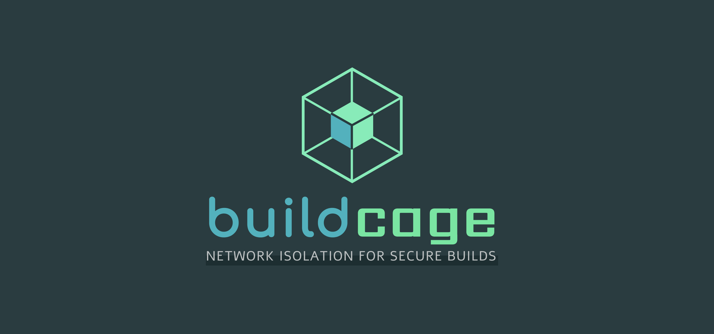

  

**Restrict outbound network access during CI builds to an allowlist of domains.**

When a compromised dependency tries to exfiltrate secrets or phone home mid-build, Buildcage blocks
it: only the destinations you allow are reachable. It runs entirely inside your GitHub Actions job —
no external service, no telemetry, free and open source.

**[buildcage.github.io](https://buildcage.github.io/)** — what it does, what changes in your build,
and how it compares to the alternatives.

## Which one do I use?

| | Use this when |
| --- | --- |
| [**Buildcage for Docker**](https://github.com/buildcage/docker) | You build a Docker image. Every `RUN` step is isolated, with no Dockerfile changes. |
| [**Buildcage for `run:` Steps**](https://github.com/buildcage/isolated-run) | You run a command directly in a workflow step — `npm install`, a test suite, a build script. |

Each repository has its own setup guide, parameter reference, and security details.
